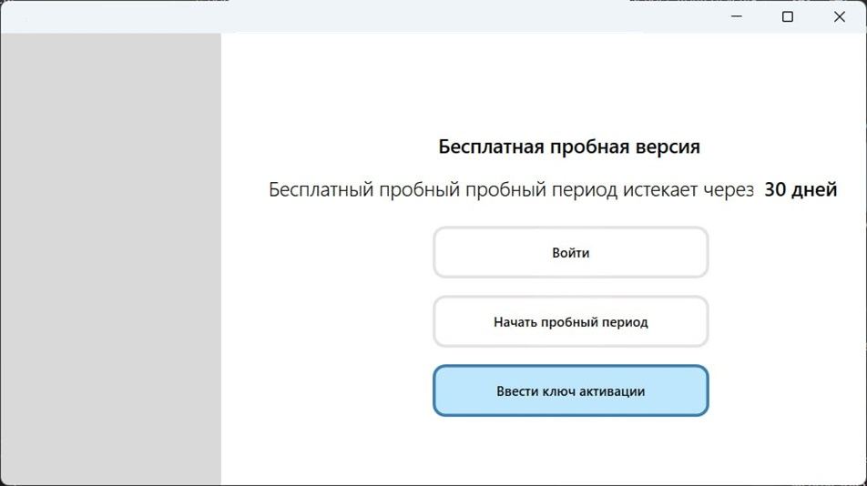
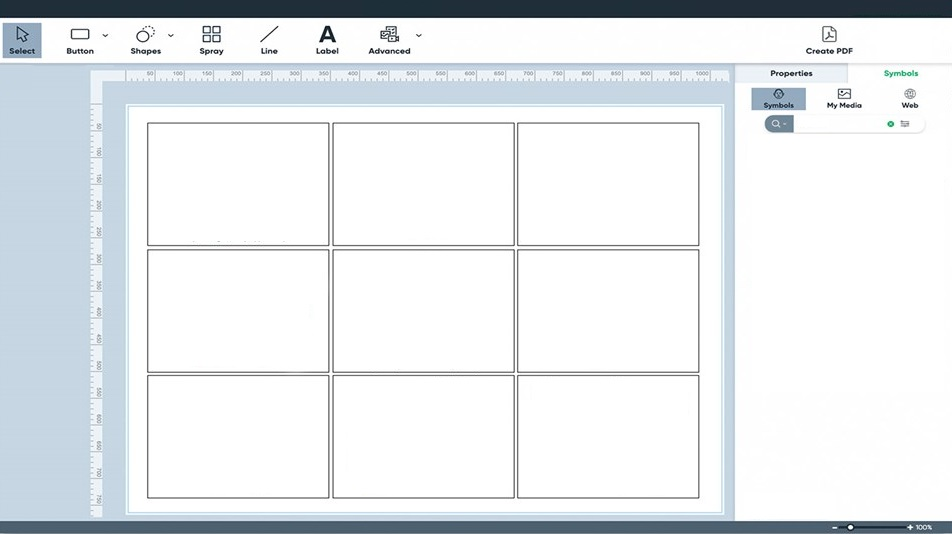

# BoardMaker
 
Windows Graphic Editor (analogue of [Boardmaker7 Editor](https://goboardmaker.com/pages/boardmaker-7))
realising main functions of the original sofware according to the contract

Desktop application created with .NET WPF

## Project has not been finished due the customer's buanckruptcy 

## Example screens

### Start window

### Project window

